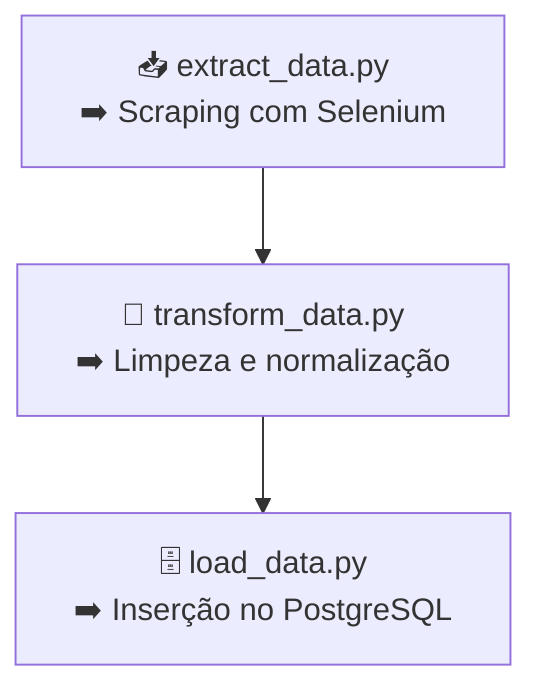

## Projeto publicado no GitHub Pages:
📎 [Acesse a documentação](https://lenontorma.github.io/webscraping_selenium/)


# 🏠 Web Scraping - Aluguéis de imóveis

Projeto de **web scraping com Python** para coletar, transformar e armazenar dados de imóveis para aluguel em Pelotas, RS, disponíveis no site [Casarão Imóveis](https://casaraoimoveis.com.br/imoveis/alugueis/pelotas/todos-os-tipos/?).

---

## 🔧 Tecnologias Utilizadas

| Ferramenta        | Descrição                              |
|-------------------|------------------------------------------|
|  | Linguagem principal do projeto |
|  | Automação e scraping da web |
|  | Gerenciamento de dependências e ambiente |
|  | Geração de documentação estática |
|  | Armazenamento estruturado dos dados |

---

## 🔍 Objetivo

> Este projeto foi desenvolvido com **finalidade de estudo prático** em web scraping, automação e engenharia de dados.

O site da [Casarão Imóveis](https://casaraoimoveis.com.br/) foi escolhido propositalmente devido aos **desafios técnicos envolvidos no scraping**, incluindo:

- Rolagem infinita para carregar todos os imóveis
- Presença de cards que são **propagandas ou não clicáveis**
- Necessidade de abrir **cada imóvel em uma nova aba** para coletar dados detalhados
- Mais de 1000 imoveis para serem coletados

Além disso, o projeto permitiu exercitar o uso de:
- Coleta automatizada com Selenium
- Estruturação do pipeline em etapas: extração, transformação e carga (ETL)
- Armazenamento dos dados em PostgreSQL
- Documentação profissional com MkDocs + Mermaid

---

## 🧠 Arquitetura (ETL)



## 🚀 Como Executar o Projeto

Pré-requisitos

 - Python 3.12+

 - Google Chrome + ChromeDriver compatível

 - PostgreSQL (opcional)

 - Poetry


## Instalação
```bash
# 1. Clone o projeto
git clone https://github.com/seu-usuario/webscraping_selenium.git
cd webscraping_selenium

# 2. Instale as dependências
poetry install

# 3. Ative o ambiente virtual
poetry shell (Deve ser instalada a extensão "poetry self add poetry-plugin-shell")

# 4. Executar no Postgres

O código do caminho: sql\create_table.sql

```

## Execução da pipeline
```bash
poetry run main.py
```
