# 3. Lógica de Scraping

A coleta dos dados é feita com o Selenium a partir da página principal da listagem de imóveis. O processo envolve rolagem dinâmica, identificação de elementos, e extração individualizada por imóvel.

---

## 🧠 Estratégia Geral

- Carregar a página com todos os imóveis disponíveis.
- Fazer scroll até que **nenhum novo imóvel seja carregado**.
- Para cada imóvel:
  - Verificar se é um card válido (com link).
  - Abrir a página do imóvel em uma nova aba.
  - Extrair endereço e características.
  - Fechar a aba e voltar à listagem.

---

## 🔍 **Detalhamento das Funções**

### `carregar_todos_os_cards(driver)`
- **Função**: Carrega todos os cards de imóveis em uma página com scroll incremental.  
- **Métodos utilizados**:  
  - Faz scroll incremental via JavaScript (`window.scrollBy`).  
  - Aguarda dinamicamente o carregamento de novos cards.  
  - Interrompe após **N tentativas sem novos cards** (evita loops infinitos).  

### `extrair_endereco(driver)`  
- **Função**: Extrai detalhes do endereço e características do imóvel.  
- **Fluxo**:  
  1. Acessa a página do imóvel (abre nova aba).  
  2. Usa `WebDriverWait` para garantir que o elemento do endereço esteja carregado.  
  3. Extrai dados estruturados com base em seletores:  
     - **Padrão HTML**: `div.row > div.col` (valores).  

## 📌 **Padrões e Boas Práticas**  

### **1. Espera Explícita**  
- Utiliza `WebDriverWait` + `expected_conditions` para evitar falhas por:  
  - Carregamento lento.  
  - Elementos dinâmicos.  

### **2. Tratamento de Exceções**  
- Ignora elementos irrelevantes (ex.: propagandas) sem interromper o fluxo.  
- Exemplo:  
  ```python
  try:
      WebDriverWait(driver, 10).until(EC.presence_of_element_located(...))
  except TimeoutException:
      print("Elemento não encontrado - pulando...")

## 🔄 Fluxo Lógico Completo

```mermaid
flowchart TD
    A[🌐 Acessar página inicial] --> B[⬇️ Fazer scroll para carregar imóveis]
    B --> C{❓ Novos imóveis carregados?}
    C -- Sim --> B
    C -- Não --> D[🔁 Iterar sobre cada card]

    D --> E{❓ Card tem link válido?}
    E -- Não --> D
    E -- Sim --> F[🆕 Abrir nova aba com imóvel]
    F --> G[⏳ Esperar carregamento]
    G --> H[🏠 Extrair endereço<br>🧾 Extrair características]
    H --> I[❌ Fechar aba]
    I --> D
```


