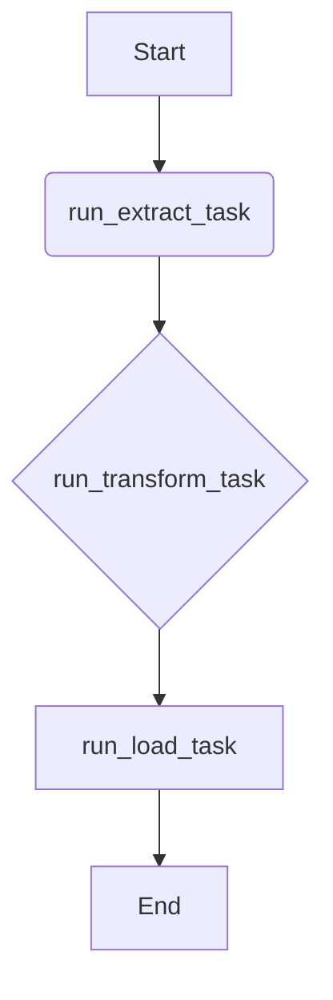
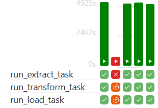
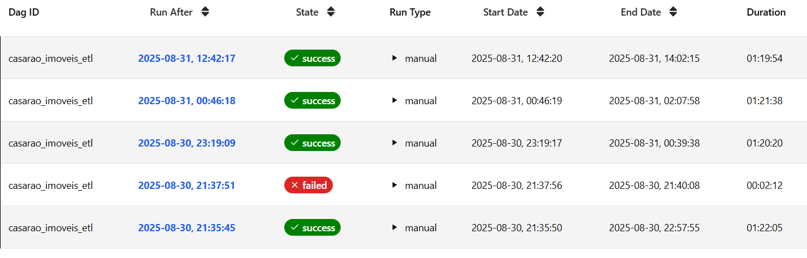

# Orquestração com Apache Airflow

Toda a pipeline de web scraping é orquestrada utilizando o Apache Airflow. Isso garante que a coleta, transformação e carga dos dados sejam executadas de forma controlada e resiliente.

## Contexto de Execução: Astro CLI

Para o desenvolvimento e execução local, este projeto utiliza o **Astro CLI**. Esta ferramenta simplifica o gerenciamento do ambiente Airflow via Docker, permitindo que a DAG seja iniciada e testada facilmente. Para mais detalhes sobre a configuração, consulte a seção [Setup do Projeto](1_setup.md).

## Visão Geral da DAG

A orquestração é controlada por uma única DAG (Directed Acyclic Graph) que define o fluxo de trabalho completo.

* **ID da DAG:** `casarao_imoveis_etl`
* **Agendamento (Schedule):** Atualmente, a DAG está configurada para ser executada apenas **manualmente** (`schedule=None`). Para agendar uma execução automática (por exemplo, diária), o parâmetro `schedule` no código da DAG pode ser alterado.
    * *Exemplo para execução diária às 03:00 UTC:* `schedule="0 3 * * *"`
* **Tags:** A DAG é categorizada com as seguintes tags para facilitar a busca na interface do Airflow: `web_scraper_casarao_imoveis`, `transform_casarao_imoveis_data`, `load_casarao_imoveis_data`.

## Estrutura e Tarefas do Pipeline

O pipeline é dividido em três tarefas principais, seguindo o padrão ETL. O fluxo de dependências garante que uma tarefa só inicie após o sucesso da anterior.

### Diagrama de Fluxo

### Detalhamento das Tarefas

1.  **`run_extract_task` (Extração)**
    * **Responsabilidade:** Esta tarefa é responsável por iniciar o navegador com Selenium, navegar até o site da Casarão Imóveis, realizar a rolagem infinita para carregar todos os cards e extrair os dados brutos de cada imóvel.
    * **Saída:** Um arquivo **JSON** contendo uma lista de todos os imóveis coletados. Este arquivo é a fonte de dados para a próxima etapa.

2.  **`run_transform_task` (Transformação)**
    * **Responsabilidade:** Lê o arquivo JSON gerado pela tarefa de extração. Realiza a limpeza e a padronização dos dados (ex: remove "R$", converte tipos, trata valores nulos, padroniza abreviações de endereços) e estrutura as informações em um formato final.
    * **Saída:** Um novo arquivo **JSON** com os dados limpos e estruturados, pronto para ser carregado no banco de dados.

3.  **`run_load_task` (Carga)**
    * **Responsabilidade:** Pega o arquivo JSON com os dados limpos da etapa de transformação e o carrega na tabela **`imoveis`** no banco de dados PostgreSQL.
    * **Conexão com o Banco:** A lógica de conexão com o PostgreSQL é gerenciada dentro do código desta tarefa.
        !!! tip "Boa Prática"
            Para aumentar a segurança e a flexibilidade, é recomendado gerenciar credenciais de banco de dados através das [Conexões (Connections)](https://airflow.apache.org/docs/apache-airflow/stable/core-concepts/connections.html) do Airflow, em vez de mantê-las em arquivos de configuração ou no código.

## Monitoramento e Logs

Para verificar a execução de uma DAG, depurar um erro ou analisar o desempenho, a interface do Airflow fornece ferramentas visuais e logs detalhados.

1.  Acesse a interface do Airflow (`http://localhost:8080`).
2.  Clique na DAG `casarao_imoveis_etl`.

A **visualização "Grid"** é a ferramenta principal para o monitoramento. Ela permite acompanhar o histórico das execuções da DAG e analisar a duração de cada tarefa individualmente.

*Na imagem acima, podemos observar as últimas execuções da DAG, com destaque para o status de cada tarefa (`run_extract_task`, `run_transform_task`, `run_load_task`) e a duração de cada etapa. Esta visão é essencial para identificar padrões de performance, gargalos, e garantir que o pipeline esteja operando dentro dos tempos esperados.*

3.  Para ver os logs detalhados de uma tarefa específica em uma execução, clique no quadrado correspondente e, em seguida, na aba **"Log"**.