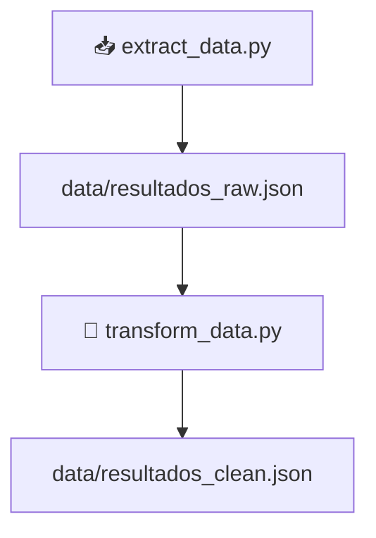
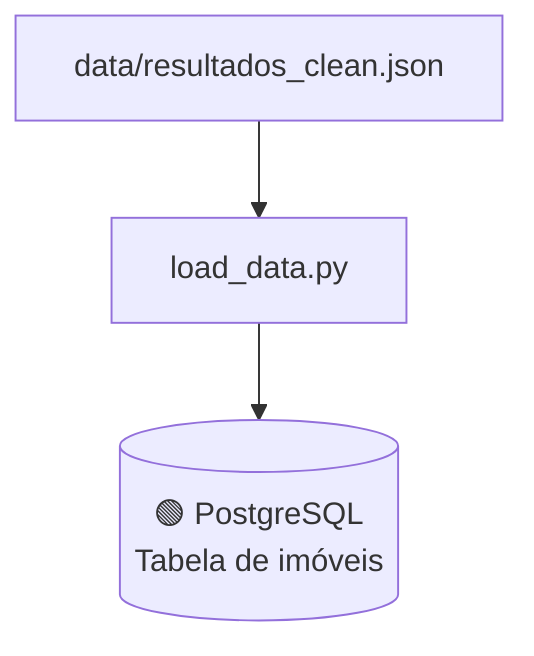
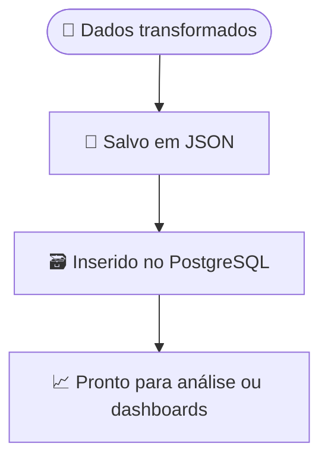

# 4. Armazenamento de Dados

Os dados coletados e transformados passam por duas formas de armazenamento:

1. **Arquivos locais** (`JSON`) para debug e histórico.
2. **Banco de dados PostgreSQL** para análise estruturada e integração com outras ferramentas.

---

## 📁 Armazenamento em Arquivos

Após cada etapa da pipeline, os dados são salvos para inspeção ou reprocessamento:

## 🗄️ Armazenamento em Banco de Dados (PostgreSQL)
O script load_data.py é responsável por ler o resultados_clean.json e inserir os dados no banco PostgreSQL.

## 🧱 Modelo de Tabela
A estrutura no banco é planejada para refletir as informações dos imóveis. Um modelo típico da tabela pode ser:

CREATE TABLE imoveis (
    id SERIAL PRIMARY KEY,
    url TEXT,
    endereco TEXT,
    aluguel TEXT,
    condominio TEXT,
    iptu TEXT,
    total TEXT
);

## ✅ Resultado
