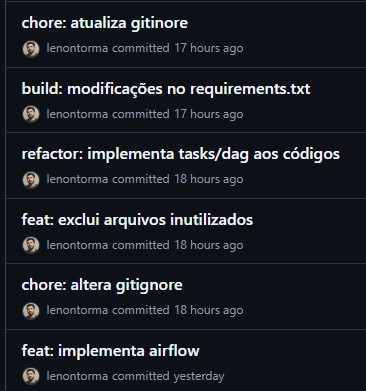
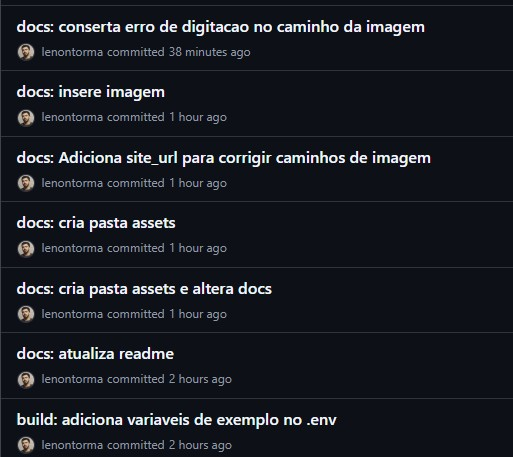
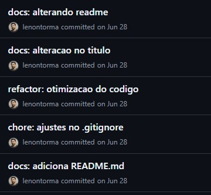
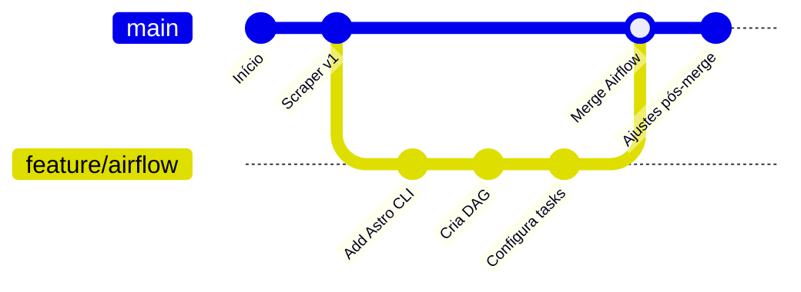

# Versionamento e Boas Práticas (Git/GitHub)

A gestão do código-fonte deste projeto segue padrões que visam garantir um histórico de alterações limpo, compreensível e rastreável. As duas principais práticas adotadas são o uso de Commits Semânticos e a estratégia de Feature Branching.

## Padrão de Commits: Commit Semântico

Para manter o histórico de commits organizado e legível, o projeto adota a especificação de [Commits Convencionais (Conventional Commits)](https://www.conventionalcommits.org/).

**Por que utilizar este método?**
* **Clareza:** Torna o histórico de alterações autoexplicativo, facilitando a identificação de novas funcionalidades, correções e outras mudanças.
* **Automação:** Permite a geração automática de changelogs e facilita a integração com processos de CI/CD.
* **Rastreabilidade:** Ajuda a entender o escopo de cada alteração de forma rápida.

A estrutura básica de um commit é:
`tipo: descrição curta`

**Tipos mais utilizados no projeto:**
* `feat`: Uma nova funcionalidade (feature).
* `build`: Alterações que afetam o sistema de construção ou dependências
* `fix`: Uma correção de bug.
* `docs`: Alterações na documentação.
* `style`: Alterações de formatação que não afetam o código (espaços, ponto e vírgula, etc.).
* `refactor`: Uma alteração de código que não corrige um bug nem adiciona uma funcionalidade.
* `chore`: Mudanças no processo de build, ou adição de dependências.

### Exemplo de Histórico de Commits

A imagem abaixo ilustra o uso do padrão no histórico de commits deste projeto.

## Estratégia de Branching: Feature Branch

O desenvolvimento de novas funcionalidades ou alterações significativas é feito em branches isoladas para não comprometer a estabilidade da branch principal (`main`).

### Caso de Uso: Implantação do Airflow

1.  Uma nova branch, `feature/airflow`, foi criada a partir da `main`.
2.  Todo o desenvolvimento relacionado ao Airflow (criação da DAG, configuração do Astro CLI, ajustes no Docker) foi realizado nesta branch.
3.  Após a conclusão e testes, a branch `feature/airflow` foi mesclada (merged) de volta na `main`, integrando a funcionalidade de orquestração ao projeto principal.

### Histórico Visual do Merge

O diagrama abaixo, gerado com Mermaid, ilustra este fluxo de desenvolvimento de forma simplificada:

Este método garante que a branch `main` sempre contenha uma versão estável e testada do projeto.